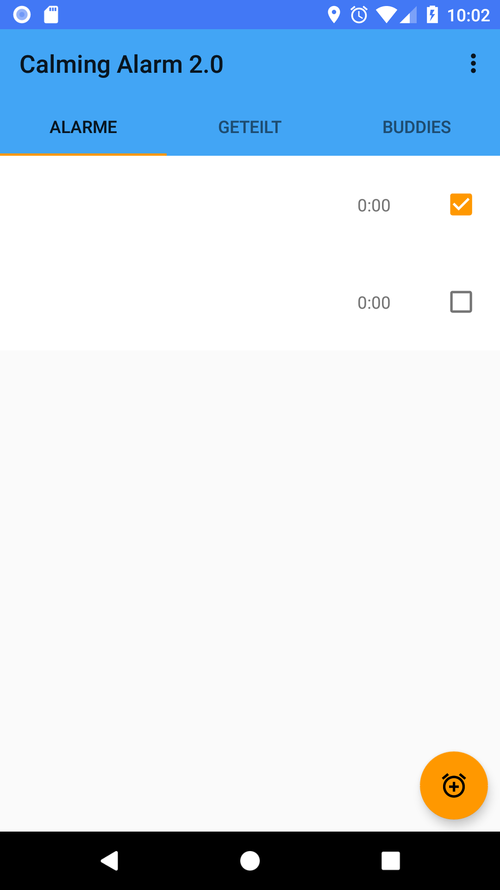

# SmartAlarmClock
My first Android App. A quite complex alarm clock app with a firebase back-end. (Evolution over one year)

### Concept
This alarm clock app lets you choose an __alarm buddy who gets notified__ if you didn't turn off the alarm and can check your live status in 
his or her control-center. 
I've also implemented some __speech recognition__ so if you check this option when setting the alarm you can turn off the alarm clock just by 
saying 'turn off' or 'shut up'. 
The app also has a timer function, you can choose alarm sound/volume/duration, upload a profile picture,
find friends by mobile number and get rewared for inviting 3 friends. 
Just try it -> [Google Play](https://play.google.com/store/apps/details?id=com.nicolai.alarm_clock) :thumbsup:

### Time line (From 0 experience to ~20.000 lines of code in one year)

_30.05.18_
   

_13.07.18_
   

_16.08.18_
   

_11.09.18_
   

_08.10.18_
  

_22.06.19_
   

# Used & Learned
 ### Basics
  * Android Studio
  * Different layouts
  * Searching (for bug fixes) on Stack Overflow and in Documentation
  * Debugging
  * Get familiar with the Android Framework (Activities, Fragments, Lifecycles...)
  * __YouTube tutorials__
  
 ### Storing data
  * Sqlite
  * Preferences
  
 ### Design
  * Constraint layout
  * Material design
 
 ### Assets
  * Strings
  * Vector drawables
  
  - - - -
  
 ### Going online (Back-End)
  * AWS or Firebase (I started with aws but as a beginner I found it quite hard to get enough learning resources and so I switch to
  __Firebase__ when I got stuck at getting the live alarm clock status of an alarm buddy)
  * Firebase Authentication
  * Fb Realtime database
  * Fb Storage (for profile pictures)
  * Fb Cloud Functions (TypeScript)
  * __Firebase in a weekend Udacity course__
  
 ### Design
  * Motionlayout
  * Animations
  * Shapes
  
 ### Cleaning up and solid knowledge
  * Udacity
    * Developing Android Apps
    * Advanced Android App Development
    * Material Design for Android Developers
    * Android Performance
  * Udemy
    * Android Java Masterclass - Become an App Developer
    * Android O & Java - The complet Android Development Bootcamp
   
 - - - -
   
 ### Performance
  * Overdrawing
  * async programming / threads
  * Android Jetpack (Architecture components IO18)
   * Room instead of plain sqLite, ViewModel, LiveData
  
 ### Security
  * Fb database rules (realtime db, storage)
  * ProGuard (rules) for deobfuscation and code shrinking
  * (Fb Crashlytics)
  
 ### Billing
  * In App Product (Send / receive whole alarms to check the status of each receiver (who has accepted the alarm) and select an alarm    buddy every time you want)
  * Google Play Billing Library
  * Fb Dynamic links and Remote Config (Invite xy friends and get the in app product for free)
  
### Deploy
 * Google Play Console
 * App Bundle
 * Google Ads
 
# In a Nutshell
This project got a little bit out of hand considering that it was my very first Android App and realy the
first coding project outside of school. 
In this app are ~10 different levels of progress with Android, Java and Firebase and round about 20.000 written
lines of code even if it's "just" an alarm clock app.
There are still some bugs and ugly lines of code despite of several house cleanings.
But the thing that took the must time and I think isn't solved completly is to, as funny as it might sound, scedule an exact alarm.
Sure you have an alarmManager and to tackle doze mode you can use setExactAndAllowWhileIdle or better setAlarmClock (with AlarmClockInfo)
but even then the device can doze of or so while sending an intent to a service or activity from the broadcastreceiver. The only thing
that seems to help so far is to use a wakeLock and keep the device alive with an async task while sending the intent.
  
